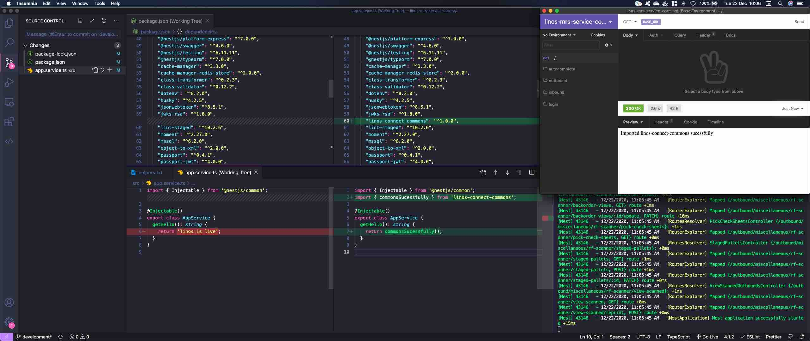

# Northwind Rest Connect Commons

Northwind Rest Commons provide developers with set of objects that works as the
transport layer between Frontend, Services and Database.


## Table of Contents

- [Installation](#markdown-header-installation)
- [Versioning with Verdaccio](#markdown-header-versioning-with-verdaccio)
- [Installation with Verdaccio](#markdown-header-installation-with-verdaccio)
- [Usage](#markdown-header-usage)
- [Working with Path Alias](#markdown-header-working-with-path-alias)
- [Database Reverse Engineering](#markdown-header-database-reverse-engineering)
    - [Prerequisites](#markdown-header-prerequisites)
    - [Pure Classes](#markdown-header-pure-classes)
    - [Entities](#markdown-header-entities)
    - [Stored Procedures](#markdown-header-stored-procedures)
    - [Views](#markdown-header-views)
    - [Builder Classes](#markdown-header-builder-classes)
- [Semantic Versioning Policy](#markdown-header-semantic-versioning-policy)


## Installation

After cloning the repository you must install all the dependencies before
publishing it locally via Verdaccio or NPM Link.

Open your terminal, go to the root folder for Northwind Rest Commons project, and
execute the following command.

```
$ yarn install
```

Then you can publish it using Verdaccio or NPM Link.


## Versioning with Verdaccio

If you choose to use Verdaccio, the first step should be installing it globally
via NPM or Yarn.

Click [here](https://verdaccio.org/docs/en/installation) to follow the official
documentation.

Once it has been installed, you only need to execute the CLI command:

```
$ verdaccio
```

When default configuration are kept, the following URL can be accessible in
order to check the packages available through local publishers.

Local artifactory: http://localhost:4873

Bellow you will find some useful commands to Publish and Unpublish packages
locally.

### Notes

- In order to publish changes to an existing package, you should always
  increment it's version prior to executing the publish command.
- Another possibility is to unpublish the package and then publishing it once
  again from version 1.0.0.

### Publish

> 1 - Increase package.json version (choose between patch, minor or major) using
> Semantic versioning. You can also do it manually by opening the package.json
> on a text editor:
>
> ```
> $ npm version (patch | minor | major)
> ```
>
> 2 - Publish to local registry using the CLI command:
>
> ```
> $ npm publish --registry http://localhost:4873
> ```

### Unpublish

> Simply execute the following command on the CLI, and then the package should
> not appear anymore on your local artifactory URL.
>
> ```
> $ npm unpublish --force northwind-rest-commons --registry http://localhost:4873
> ```


## Installation with Verdaccio

Prerequisites: [Node.js](https://nodejs.org/) (`>=v12.8.0`).

You can install Northwind Rest Commons using npm:

```
$ npm i --registry http://localhost:4873 northwind-rest-commons
```

It's recommended using the caret (`^`) in `package.json` e.g.
`"northwind-rest-commons": "^1.0.0"` to guarantee you are always updated to the
latest minor or patch version.


## Usage

After installing, you can run Northwind REST Commons on any file or directory
like this:

```
import { commonsSucessfully } from 'northwind-rest-commons';
```

This imports the example function commonsSucessfully(), that simply returns a
string with a successfull message.




## Working with Path Alias

This project is configured to use Path Alias in order to make it easier for developers to import their modules without having to rely only on using relative paths.

These paths are configured through "./tsconfig.json" in the "paths" property.

VsCode understands the paths defined in './tsconfig.json', but that doesn't mean that after building the project into './dist' that your imports are going to work correctly.

If you happen to stumble uppon a "MODULE_NOT_FOUND" error when trying to import the objects inside other projects, this might be happening because the transpiled JS code does not work with absolute paths.

Possible solutions to the error above:

1. Use relative paths to import the files
2. Configure a new Path Alias in './tsconfig.json' and make use of it, e.g.:

    ```
    import { UserContext } from '@src/decorators/User.decorator';
    ```

## Database Reverse Engineering

### Prerequisites

1. In order to access the DB you should be connected through a VPN.

2. Clone the file ".env.example" and call it ".env", then fill it accordingly. E.g.:

```
  RDS_TYPE=mssql
  RDS_HOSTNAME=us0328-dev-mrs-rdssqldb-00.cbmuittvt2tm.us-east-1.rds.amazonaws.com
  RDS_PORT=1433
  RDS_USERNAME=<your_username>
  RDS_PASSWORD=<your_password>
  RDS_DB_NAME=CONNECT_55
  APP_ENV=
  DIR_DATA=./src/typeorm
```

### Pure Classes

Pure Classes are generated by a fork from [typeorm-model-generator](https://www.npmjs.com/package/typeorm-model-generator).

The forked and adapted repository can be found in [here](https://github.com/bruno-marcondes-levvel/typeorm-model-generator).

Inside "typeorm-model-generator" you will also find the template used to generate the classes, it is located at "./src/templates/entity-pure.mst".

All pure classes were generated by using this forked repository, and then copied into "./src/pure-classes".

### Entities

Entities are generated via a JS script located at "./src/typeorm-model-generator/generate-entities.ts".

To run the script, you only need to execute the CLI command:

```
$ npm run generate:entities
```

Check the result by looking into "./src/typeorm/entities".

### Stored Procedures

Stored Procedures are generated via a JS script located at "./src/typeorm-model-generator/generate-stored-procedures.ts".

To run the script, you only need to execute the CLI command:

```
$ npm run generate:stored-procedures
```

Check the result by looking into "./src/typeorm/stored-procedures".

### Views

Views are generated via a JS script located at "./src/typeorm-model-generator/generate-views.ts".

To run the script, you only need to execute the CLI command:

```
$ npm run generate:views
```
Check the result by looking into "./src/typeorm/views".

### Builder Classes

Builder Classes are generated by a fork from [typeorm-model-generator](https://www.npmjs.com/package/typeorm-model-generator).

The forked and adapted repository can be found in [here](https://github.com/bruno-marcondes-levvel/typeorm-model-generator).

Inside "typeorm-model-generator" you will also find the template used to generate the classes, it is located at "./src/templates/entity-builder.mst".

All Builder Classes were generated by using this forked repository, and then copied into "./src/builder-classes".


## Semantic Versioning Policy

Northwind Rest Commons follows [semantic versioning](https://semver.org).
However, it's not always clear when a minor or major version bump occurs. To
help clarify this for everyone, we've defined the following semantic versioning
policy:

- Patch release (intended to not break your lint build)
    - A bug fix in a file.
    - A bug fix to the DB scripts.
    - Improvements to documentation.
    - Re-releasing after a failed release (i.e., publishing a release that doesn't
      work for anyone).
- Minor release (might break your lint build)
    - A new entity or model is created.
    - A new option to an existing rule that does not result in errors by default.
    - A new CLI capability is created.
- Major release (likely to break your lint build)
    - A entity or model property is removed or changed in an incompatible way.
    - An existing entity or model is removed or changed in an incompatible way.
